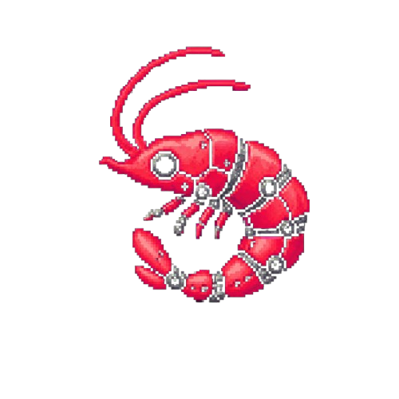

# MechaShrimp


MechaShrimp is a Discord companion for running a server-wide Krillion.io score tracker. It watches a configured channel for posted result blocks, validates each submission, prevents duplicate entries for the same user on the same game, and turns the saved results into daily and lifetime leaderboards.

The project is designed around a simple flow:

- A server admin chooses the channel the bot should watch.
- Players paste the result string from Krillion's "Copy Results" button.
- The bot validates the pasted score and answer sequence.
- Results are stored per guild and per player.
- The bot can show the current day's standings, a historical game board, or an overall lifetime leaderboard.

## What the bot does

- Parses Krillion results from the copied text block.
- Verifies that the answer values actually add up to the displayed score.
- Counts category totals such as Krillions, Deep Cuts, Rares, Schoolers, Clevers, Plankton, and blanks.
- Prevents a user from submitting more than one result for the same daily game.
- Tracks per-server scores across days.
- Publishes a leaderboard at the end of the day in the configured channel.
- Shows lifetime player stats, best game, latest game, and total category counts.

## Commands

The bot exposes Discord slash commands:

- `/link` — posts the link to the Krillion daily dive.
- `/set_krillion_channel` — selects which channel the bot should watch for submissions.
- `/scoreboard <game_number>` — shows a leaderboard for a specific game. If no number is supplied, it defaults to the current game.
- `/overall_scoreboard` — shows overall server rankings by total points and total Krillions.
- `/user_stats <user>` — shows stored lifetime stats for a selected user.
- `/reset_scores` — clears the current server's score history.

## Setup

1. Create a virtual environment and install the package:

   ```bash
   python -m venv .krillion_bot
   .\.krillion_bot\Scripts\Activate.ps1
   pip install -e .
   ```

2. Create a `.env` file in the project root with your Discord token and database path:

   ```env
   DISCORD_TOKEN=your_discord_bot_token
   DB_FILE_LOCATION=./test.db
   ```

3. Start the bot:

   ```bash
   python -m krillion_bot.bot
   ```

## Project structure

- `src/krillion_bot/bot.py` — bot bootstrapping and startup.
- `src/krillion_bot/commands.py` — Discord command registration.
- `src/krillion_bot/events.py` — message and lifecycle event handling.
- `src/krillion_bot/services/database.py` — SQLite-backed storage logic and query helpers.
- `src/krillion_bot/services/parser.py` — Krillion result parsing and validation.
- `src/krillion_bot/services/displays.py` — formatting for scoreboards and player stats.
- `src/krillion_bot/utils/` — shared helpers for categories, emojis, and game timing.
- `tests/` — unit tests covering parsing, scoreboards, and database operations.

## Notes

This bot is built for a single server's scoring history. It stores data in SQLite and keys the results by the Discord guild ID so each server keeps separate rankings.
